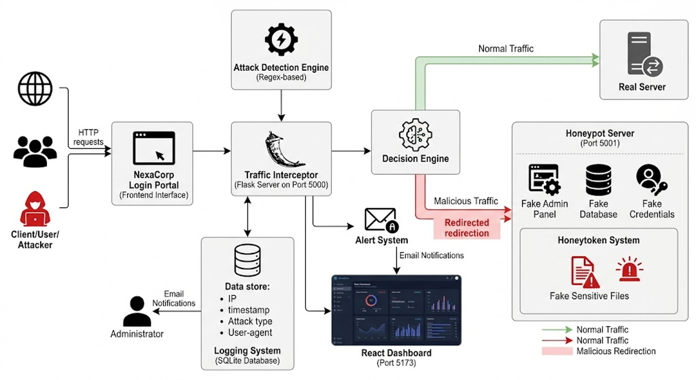

# 🍯 Honeypot Security System

A network security honeypot that lures attackers, logs their activity, and sends real-time email alerts. Built as a Network Security project using Python and Node.js.

---

## 📌 What It Does

- Deploys a **fake login page** to attract unauthorized access attempts
- **Intercepts and detects** suspicious traffic and attack patterns
- **Logs all attack data** (IP, timestamp, credentials tried, etc.) to a local database
- Sends **real-time email alerts** when an intrusion attempt is detected
- Provides a **dashboard** to visualize attack data



---

## 📁 Folder Structure

```
honeypot-project/
├── interceptor/          # Fake login app that captures attacker input
│   ├── app.py            # Flask app serving the fake login page
│   ├── detector.py       # Detects suspicious patterns
│   └── templates/
│       └── login.html    # Fake login UI shown to attackers
│
├── honeypot/             # Core honeypot server
│   ├── honeypot_server.py
│   └── templates/
│       └── fake_admin.html
│
├── logger/               # Logs attack events to the database
│   └── logger.py
│
├── alerts/               # Email alert system
│   └── alerter.py
│
├── dashboard/            # Frontend dashboard to view attack logs
│   └── package.json
│
├── database/             # SQLite database (auto-created, not committed)
│   └── attacks.db
│
├── simulate_attack.py    # Script to simulate an attack for testing
├── .env.example          # Template for environment variables
└── README.md
```

---

## ⚙️ Setup Instructions

### 1. Clone the repository

```bash
git clone https://github.com/vathsalyar/honeypot-project.git
cd honeypot-project
```

### 2. Install Python dependencies

```bash
pip install flask
```

### 3. Configure environment variables

```bash
cp .env.example .env
```

Edit `.env` and fill in your credentials:

```
ALERT_EMAIL=your_email@gmail.com
EMAIL_PASSWORD=your_gmail_app_password
```

> **Note:** Use a [Gmail App Password](https://support.google.com/accounts/answer/185833), not your real Gmail password.

### 4. Run the interceptor (fake login server)

```bash
cd interceptor
python app.py
```

### 5. Run the honeypot server

```bash
cd honeypot
python honeypot_server.py
```

### 6. (Optional) Simulate an attack for testing

```bash
python simulate_attack.py
```

### 7. (Optional) Run the dashboard

```bash
cd dashboard
npm install
npm start
```

---

## 🔐 Security Notes

- **Never commit your `.env` file.** It contains sensitive credentials.
- The `database/attacks.db` file is excluded from version control as it may contain real attacker data.
- This project is intended for **educational and research purposes** in controlled environments only.

---

## 🛠️ Tech Stack

| Layer | Technology |
|---|---|
| Backend | Python, Flask |
| Database | SQLite |
| Alerts | Gmail SMTP |
| Dashboard | Node.js |
| Detection | Custom Python logic |

---
